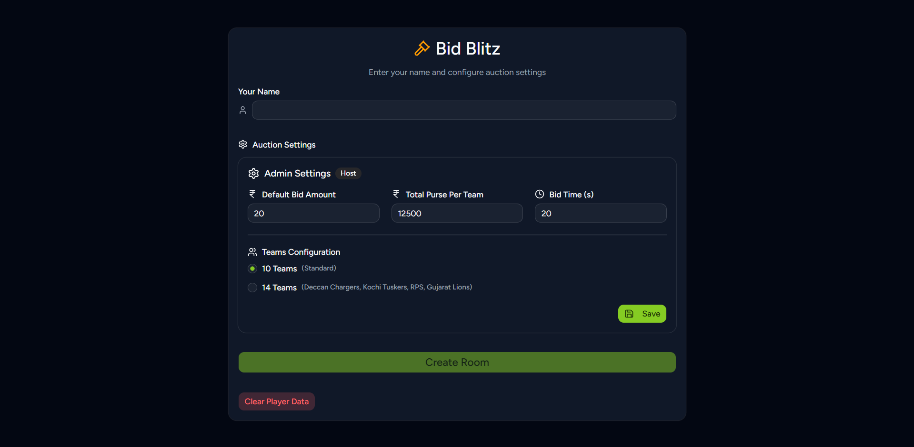
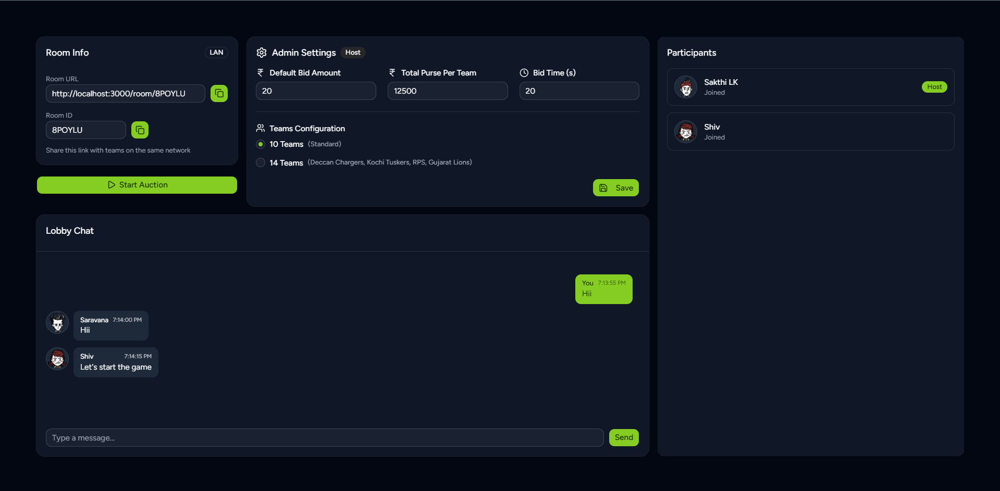
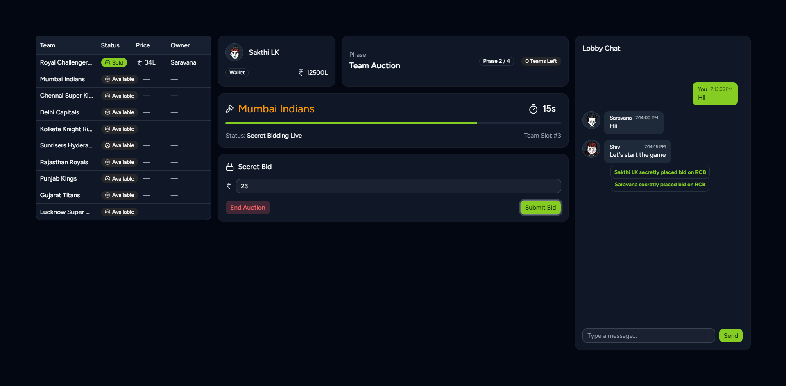
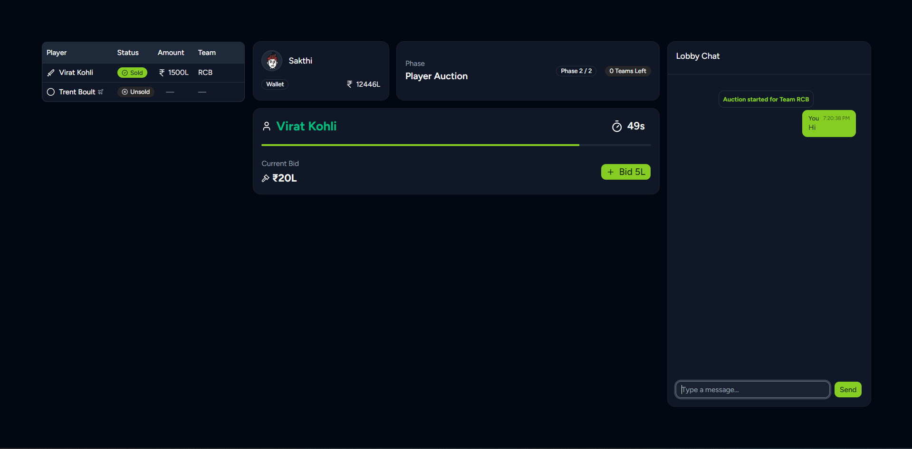
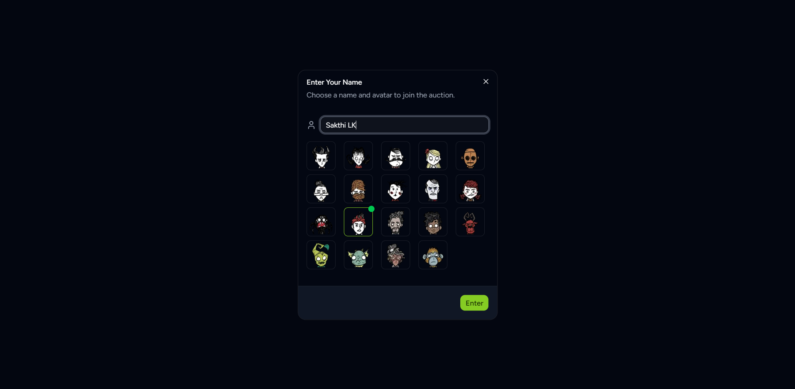

# Bid-Blitz

A real-time multiplayer IPL auction game where teams bid on players, featuring chat, participant management, and customizable admin settings.

## Overview

This project recreates the IPL auction experience in an interactive online environment where multiple users can join, bid, and compete in real time.

The system currently supports:

- Team Auction
- Player Auction
- Live bid updates using WebSockets
- Real-time synchronization across connected clients

## 

## Tech Stack

### Frontend

- Next.js
- Component-based UI architecture
- WebSocket client integration

### Backend

- Node.js (JavaScript)
- WebSocket server
- Auction state management
- Bid validation and broadcasting logic

### Communication

- WebSockets for:
  - Instant bid updates
  - Auction state synchronization
  - Multi-user interaction

## Features

### 1. Lobby

The main entry point to the application.

- Displays active players
- Configuration for auction
- Real-time connection status

### 2. Team Auction

Users can bid on complete teams in a live auction environment.

- Real-time highest bid tracking
- Live updates across all clients
- Countdown-based winner selection

### 3. Player Auction

Individual player bidding with dynamic competitive interaction.

- Real-time bidding
- Automatic highest bid validation
- Final allocation after timer ends

## Real-Time Architecture

The application follows an event-driven architecture:

1. Client connects to the WebSocket server.
2. A user places a bid.
3. The server validates the bid.
4. The updated auction state is broadcast to all connected clients.
5. Clients update their UI instantly.

This ensures:

- No page refresh required
- Low latency updates
- Fully synchronized auction state

## Visual Assets Disclaimer

Some player profile images use characters inspired by Don't Starve Together as display pictures (PFPs).

These images are used strictly for non-commercial, educational, and demonstration purposes. All character rights belong to their respective creators and owners.

## Future Improvements

- User authentication and role-based bidding
- Admin control panel
- Auction history and analytics
- Persistent database integration
- Production-ready deployment setup

## Conclusion

The Online IPL Auction Game demonstrates how to build a real-time, event-driven web application using WebSockets and a modern frontend framework.

It highlights:

- Real-time communication
- State synchronization
- Competitive auction logic
- Scalable architecture design

This project serves as a strong foundation for understanding live systems and multiplayer interaction models in web applications.
